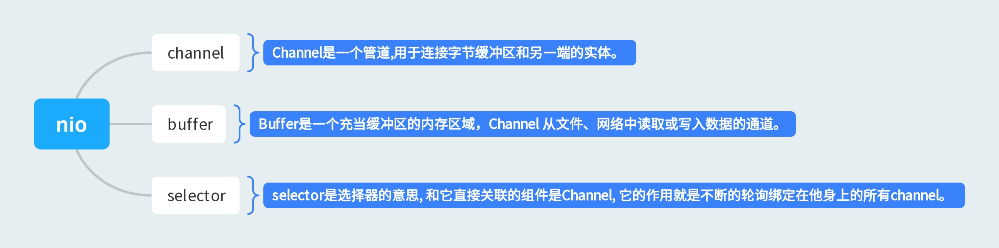

# JavaCourseCodes
极客时间毕业总结

## 1.jvm

首先Java源代码文件(.java后缀)会被Java编译器编译为字节码文件(.class后缀)，然后由JVM中的类加载器加载各个类的字节码文件，加载完毕之后，交由JVM执行引擎执行。在整个程序执行过程中，JVM会用一段空间来存储程序执行期间需要用到的数据和相关信息，这段空间一般被称作为Runtime Data Area（运行时数据区），也就是我们常说的JVM内存。因此，在Java中常常说到的内存管理就是针对这段空间进行管理。JVM初始运行的时候都会分配好Method Area（方法区）和Heap（堆），而JVM 每遇到一个线程，就为其分配一个Program Counter Register（程序计数器）, VM Stack（虚拟机栈）和Native Method Stack（本地方法栈），当线程终止时，三者（虚拟机栈，本地方法栈和程序计数器）所占用的内存空间也会被释放掉。

## 2.NIO

NIO（Non-blocking I/O，在Java领域，也称为New I/O），是一种同步非阻塞的I/O模型，也是I/O多路复用的基础，已经被越来越多地应用到大型应用服务器，成为解决高并发与大量连接、I/O处理问题的有效方式。NIO的三个核心组件是channel，buffer，selector。

channel：channel是一个管道,用于连接字节缓冲区和另 一端的实体, 这个字节缓冲区就是ByteBuffer, 另一端的实体可以是一个File 或者是 Socket ;

buffer：缓冲区本质上是一个可以读写数据的内存块，可以理解成是一个容器对象（含数组），该对象提供了一组方法，可以更轻松的使用内存块，缓冲区对象内置了一些机制（position，limit，mark），能够跟踪和记录缓冲区的状态变化情况。Channel提供了从文件、网络读取数据的渠道，但是读取和写入的数据必须经由Buffer。

selector：Selector用于检测注册的channel是否有事件发生，如果检测到有事件发生，就去获取事件并处理发生的事件。

## 3.并发编程

并发编程的目的是为了充分利用资源让程度运行的更快，原则是，将代码中串行执行的部分变成并发执行。并发：指多线程交替执行；并行：指同时执行。

线程：进程是一个可执行的程序，是系统分配资源的基本单位。线程是进程内部相对独立的可执行单元，是任务调度的基本单位。

并发编程的目的是为了让程序运行的更快，但是，并不是启动更多的线程就能让程序最大限度地并发执行。在使用多线程时需面临以下的几个挑战：1、上下文切换；2、死锁；3、资源限制。

Java代码在编译后生成字节码，字节码被类加载器加载到JVM中，JVM执行字节码最终转化为汇编指令在CPU上执行。Java中所使用的并发机制依赖于JVM的实现和CPU的指令。

## 4.Spring 和 ORM 等框架

orm：对象关系映射（Object Relational Mapping，简称ORM）模式是一种为了解决面向对象与关系数据库存在的互不匹配的现象的技术。ORM框架是连接数据库的桥梁，只要提供了持久化类与表的映射关系，ORM框架在运行时就能参照映射文件的信息，把对象持久化到数据库中。

spring的loc叫做控制反转，就是通过spring来管理对象的创建，配置，生命周期。相当于将对对象的控制权交给了spring，就不需要人工来管理对象之间的复杂关系，好处就是解耦。spring中主要提供了两种loc容器，分别是：BeanFactory和ApplicationContext，通过他们来实现对Bean的管理。

spring AOP叫做面向切面编程，是一个编程范式，目的是提高代码的模块性。Spring AOP基于动态代理的方式实现，如果是实现了接口的话就会使用jdk动态代理，反之则会使用CGLIB代理，aop中的应用主要体现在 事务.日志 .异常处理等的方面。通过在代码的前后做一些增强处理，可以实现对业务逻辑的隔离，提高代码的模块化能力，同时也是解耦。spring主要提供了Aspect切面，JoinPoint连接点，PointCut切入点，Advice增强等的实现方式。

## 5.msql数据库和sql

SQL 是用于 数据分析和数据处理的最重要的编程语言之一。SQL (Structured Query Language:结构化查询语言) 是用于管理关系数据库管理系统（RDBMS）。 SQL 的范围包括数据插入、查询、更新和删除，数据库模式创建和修改，以及数据访问控制。

SQL语句分类：

- DDL，数据定义语言（Data Definition Language），用来操作数据库、操作表；
- DML，数据操纵语言（Data Manipulation Language），用来操作表中的记录——增、删、改；
- DQL，数据查询语言（Data Query Language），用来操作表中的记录——查；
- DCL，数据控制语言（Data Control Language），用来对用户权限进行设置。

MySQL，一个关系型数据库管理系统，用来持久化保存数据。

事物的隔离级别
1、read uncommitted（读未提交）事务中最低级别，可以读取未提交的数据，也称脏读。危险少用。
2、read commited（读提交）大多数数据库默认隔离级别，只能读取已经提交的内容。但无法避免重复读和幻读。
3、repeatable read（可重复读）Mysql默认事务隔离级别。可避免不可重复度和脏读的问题，确保同一个事务的多个实例在并发读取数据时，会看到同样的数据。
4、serializable（可串行化）事务的最高隔离级别。他它对强行对事务进行排序，使之不会发生冲突，实际上是在每个读的数据行前加个锁，这种级别可能导致大量的超时现象和锁竞争。

## 6.分库分表

将原本存储在一个库的数据分块存储在多个库上，将原本存储在一个表的数据分块存储在多个表里面。

分库分表的目的就是为了缓解数据库的压力，最大限度提高数据操作的效率。

分库分表的优缺点
水平切分的优点如下：

单库单表的数据保持在一定的量级，有助于性能的提高。
切分的表的结构相同，应用层改造较少，只需要增加路由规则即可。
提高了系统的稳定性和负载能力。
水平切分的缺点如下：

切分后，数据是分散的，很难利用数据库的Join操作，跨库Join性能较差。
拆分规则难以抽象。
分片事务的一致性难以解决。
数据扩容的难度和维护量极大
垂直切分的优点如下：

拆分后业务清晰，拆分规则明确。
系统之间进行整合或扩展很容易。
按照成本、应用的等级、应用的类型等将表放到不同的机器上，便于管理。
便于实现动静分离、冷热分离的数据库表的设计模式。
数据维护简单。
垂直切分的缺点如下：

部分业务表无法关联（Join），只能通过接口方式解决，提高了系统的复杂度。
受每种业务的不同限制，存在单库性能瓶颈，不易进行数据扩展和提升性能。
事务处理复杂。

## 7.RPC和微服务

微服务是一种分布式的方式，通过微服务可以将业务拆分，使业务职责单一化，业务解耦。微服务通常都是集群部署，服务之间的通信需要通过RPC完成。集群需要通过服务治理去管理，服务治理主要管理：接口方法和服务之间的映射关系、负载均衡、健康检测、服务续约、服务发现、容灾容错等。服务治理主要有：服务发现、服务续约、健康检测、负载均衡、容灾容错等。主要是通过将服务注册到注册中心实现这些功能。比较出名的注册中心有：Eureka、nacos、zookeeper等。

RPC是上层协议，底层可以基于TCP协议，也可以基于HTTP协议。它是基于分布式架构而出现的，现在RPC主要是通过TCP传输协议和高效的序列化反序列完成。高性能的TCP传输手动主要是通过IO的多路复用和零拷贝，最典型的框架就是netty，而IO的多路复用主要手段有select、poll、epoll，其中epoll是liunx主要的io多路复用模型的手段，也是性能最高的。

## 8.分布式缓存

分布式缓存的优点特性

1、高性能:当传统数据库面临大规模数据访问时,磁盘I/O 往往成为性能瓶颈,从而导致过高的响应延迟.分布式缓存将高速内存作为数据对象的存储介质,数据以key/value 形式存储,理想情况下可以获得DRAM 级的读写性能;
2、动态扩展性:支持弹性扩展,通过动态增加或减少节点应对变化的数据访问负载,提供可预测的性能与扩展性;同时,最大限度地提高资源利用率;
3、高可用性:可用性包含数据可用性与服务可用性两方面.基于冗余机制实现高可用性,无单点失效(single point of failure),支持故障的自动发现,透明地实施故障切换,不会因服务器故障而导致缓存服务中断或数据丢失.动态扩展时自动均衡数据分区,同时保障缓存服务持续可用;
4、易用性:提供单一的数据与管理视图;API 接口简单,且与拓扑结构无关;动态扩展或失效恢复时无需人工配置;自动选取备份节点;多数缓存系统提供了图形化的管理控制台,便于统一维护;
5、分布式代码执行(distributed code execution):将任务代码转移到各数据节点并行执行,客户端聚合返回结果,从而有效避免了缓存数据的移动与传输。

分布式缓存的实现手段，在实际开发中，比较主流的分布式缓存系统主要有Memcached 和 Redis，这两款系统都采用key-value存储方案，却有各自的优缺点。

## 9.分布式消息队列

消息队列(Message Queue)是一种进程间通信或同一进程的不同线程间的通信方式。根据这个定义可知，消息队列主要有两类：一类是内存中的消息队列，比如在Java语言中就包ArrayBlockingQueue，LinkedBlockingQueue等等。他们主要是为应用中的线程通信方式。另外一类是分布式消息队列，比如常见的有kafka,ribbitmq,rocketmq,activemq等等，他们主要是为不同的应用之间的通信。

使用消息队列在业务开发中可以解决哪些问题？

1、系统之间异步通信，生产者发送消息不需要等待消费者消费消息的完成。

2、系统之间解耦，这里可以拿注册功能送积分的例子来说明，注册完整后只要发送一条消息到消息队列，积分服务消费该条注册消息来进行积分赠送，实现注册服务和积分服务的解耦。

3、流量削峰， 主要是用来解决大流量请求击垮后台服务的问题，通过消息的先进先出特性和消息堆积能力，实现大流量承接。我工作中发票采集服务就使用这个功能来解决高峰期发票量大的问题。通过rocketmq来接收并存储大量发票消息，而发票数据的解析，持久化存储就开启消费者来消费。

4、消息广播功能，比如发票服务接收到新发票数据，需要通知到不同的业务服务，只要业务服务增加消费者就可以了，不需要修改生产者的功能。

