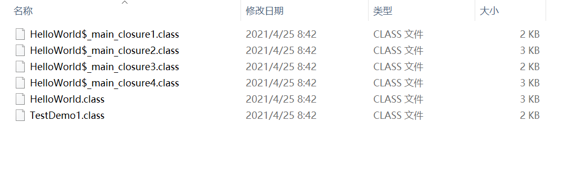

# Groovy学习

## 引言

2021.4.24是学习Groovy的第一天，首先，我觉得学习任何一种语言都要先了解这种语言的特性，因为只有了解了特性之后才能达到比较迅速的学习或者运用效果，那么groovy的特点是什么呢？

Groovy是一种动态语言，它和Java类似（算是Java的升级版，但是又具备脚本语言的特点），都在Java虚拟机中运行。当运行Groovy脚本时它会先被编译成Java类字节码，然后通过JVM虚拟机执行这个Java字节码类。

Groovy是一种基于Java平台的面向对象语言。Groovy 1.0于2007年1月2日发布，其中Groovy 2.4是当前的主要版本。Groovy通过Apache License v 2.0发布。groovy是一种弱类型语言，对变量不需要事先定义类型，还有很重要的一点就是groovy也需要运行在jvm上。总体来说，groovy的学习成并不高，如果本来java基础就比较好的话快速上手应该是没问题的。

## Groovy特点

- 同时支持静态和动态类型。

- 支持运算符重载。
- 本地语法列表和关联数组。
- 对正则表达式的本地支持。
- 各种标记语言，如XML和HTML原生支持。
- Groovy对于Java开发人员来说很简单，因为Java和Groovy的语法非常相似。
- 您可以使用现有的Java库。
- Groovy扩展了java.lang.Object。

## Groovy下载和安装

[下载链接]([www.groovy-lang.org/download.html](http://www.groovy-lang.org/download.html))

- 新建GROOVY_HOME，值为安装的路径；cfs,res资源设计，rfs
- 修改PATH，在最后追加%GROOVY_HOME%\bin；

## Groovy关键字

| as     | assert  | break      | case       |
| ------ | ------- | ---------- | ---------- |
| catch  | class   | const      | continue   |
| def    | default | do         | else       |
| enum   | extends | false      | Finally    |
| for    | goto    | if         | implements |
| import | in      | instanceof | interface  |
| new    | pull    | package    | return     |
| super  | switch  | this       | throw      |
| throws | trait   | true       | try        |
| while  |         |            |            |

其中 **def** 是在 Groovy 用来定义标识符的关键字。**def**关键字定义的变量类型都是Object, 任何变量, 方法都能用**def**  定义/声明 , 在 Groovy 中 "一切都是对象"。

## 与Java相比之下的Groovy

### 范围运算符

```
String sample = "Hello world";
println(sample[4]); // Print the 5 character in the string,o

//Print the 1st character in the string starting from the back
println(sample[-1]);//,d
println(sample[1..2]);//Prints a string starting from Index 1 to 2,el
println(sample[4..2]);//Prints a string starting from Index 4 back to 2，oll
```

### 默认参数

### 弱类型

在开发期间可以是一个强大的实用程序，但是当代码变得太大和复杂时，可能导致在后期开发阶段的可维护性问题。

### return关键字可省略, 方法的最后一句表达式可作为返回值返回

### 导航操作符 ( ?. )可帮助实现对象引用不为空时方法才会被调用

```
// java
if (object != null) {
    object.getFieldA();
}
// groovy
object?.getFieldA()
```

### 闭包

闭包是一个短的匿名代码块。每个闭包会被编译成继承 groovy.lang.Closure 类的类，这些类有一个 call 方法，通过该方法可以传递参数并调用这个闭包。



```
public static void main(String[] args) {
    def hello = {println "Hello World"}
    hello.call()

    // 包含形式参数
    def hi = {
        person1, person2 -> println "hi " + person1 + ", "+ person2
    }
    hi.call("xiaoming", "xiaoli")

    // 隐式单个参数, 'it'是Groovy中的关键字
    def hh = {
        println("haha, " + it)
    }
    hh.call("zhangsan")
}
```

### with用法

```
//java
public static void main(String[] args) {
    Calendar calendar = Calendar.getInstance();
    calendar.set(Calendar.MONTH, Calendar.DECEMBER);
    calendar.set(Calendar.DATE, 4);
    calendar.set(Calendar.YEAR, 2018);
    Date time = calendar.getTime();
    System.out.println(time);
}
```


```
//groovy
Calendar instance = Calendar.getInstance()
instance.with {
    //it 指 instance 这个引用
    it.set(Calendar.MONTH, Calendar.DECEMBER)
    //可以省略it, 使用命令链
    set Calendar.DATE, 4
    set Calendar.YEAR, 2018
    //instance.getTime()
    println(it.getTime())
    println(getTime())
    //对于get开头的方法名可以省略get
    println(time)
}
```

### 集合

```
//def list = [12, 10, 13, 6] // 列表, 默认是ArrayList
def list = ['Python', 'Groovy', 'Java'] as List // 字符串列表
// 同list.add(10)
list << 10

def list1 = [9, 8, [2, 4], 5] // 嵌套列表
def list2 = ['Groovy', 19, 2.11] // 异构的对象引用列表
def list3 = [] // 一个空列表

def set = ["22", "61", "82"] as Set // LinkedHashSet, as运算符转换类型

def map = ['TopicName': 'Lists', 'TopicName': 'Maps'] // map, LinkedHashMap
def map1 = [:] // 空map

// 循环
map.each {
    print it.key
}
set.each {
//print it.key
	println(it)
}
```

### 对于没有任何类定义

如果Groovy脚本文件里只有执行代码，没有定义任何类（class），则编译器会生成一个Script的子类，类名和脚本文件的文件名一样，而脚本的代码会被包含在一个名为run的方法中，同时还会生成一个main方法，作为整个脚本的入口。

### 对于仅有一个类

如果Groovy脚本文件里仅含有一个类，而这个类的名字又和脚本文件的名字一致，这种情况下就和Java是一样的，即生成与所定义的类一致的class文件, Groovy类都会实现`groovy.lang.GroovyObject`接口。

### 对于多个类

如果Groovy脚本文件含有一个或多个类，groovy编译器会很乐意地为每个类生成一个对应的class文件。如果想直接执行这个脚本，则脚本里的第一个类必须有一个static的main方法。

### Groovy元对象编程

### JSON转换

- 首先创建JsonSlurper类的一个实例
- 然后我们使用JsonSlurper类的parseText函数来解析一些JSON文本。
- 当我们获取对象时，您可以看到我们实际上可以通过键访问JSON字符串中的值。

```
//文本解析
import groovy.json.JsonSlurper 

class Example {
   static void main(String[] args) {
      def jsonSlurper = new JsonSlurper()
      def object = jsonSlurper.parseText('{ "name": "John", "ID" : "1"}') 
		
      println(object.name);
      println(object.ID);
   } 
}
//John 
//1
```

现在让我们谈谈如何在Json中打印输出。这可以通过JsonOutput方法来完成。此方法负责将Groovy对象序列化为JSON字符串。

**参数** -参数可以是数据类型的对象 - 数字，布尔，字符，字符串，日期，地图，闭包等。

**返回类型** -返回类型是一个JSON字符串。

```
import groovy.json.JsonOutput 
class Example {
   static void main(String[] args) {
      def output = JsonOutput.toJson([name: 'John', ID: 1])
      println(output);  
   }
}
//输出，{"name":"John","ID":1}
```

### DSLS

Groovy允许在顶层语句的方法调用的参数周围省略括号。这被称为“命令链”功能。这个扩展的工作原理是允许一个人链接这种无括号的方法调用，在参数周围不需要括号，也不需要链接调用之间的点。


## 在 idea 中开发的配置

### 版本要求

- JDK 1.6及以上
- Maven 3.0.1及以上

### 配置pom.xml

```xml
<build>
    <plugins>
    <!-- 增加 gmavenplus 插件 允许集成Groovy到Maven-->
      <plugin> 
        <groupId>org.codehaus.gmavenplus</groupId>  
        <artifactId>gmavenplus-plugin</artifactId>
        <version>1.7.1</version>
        <executions>
          <execution>
            <goals>
              <goal>addSources</goal>
              <goal>addTestSources</goal>
              <goal>generateStubs</goal>
              <goal>compile</goal>
              <goal>generateTestStubs</goal>
              <goal>compileTests</goal>
              <goal>removeStubs</goal>
              <goal>removeTestStubs</goal>
            </goals>
          </execution>
        </executions>
      </plugin>
      <plugin>
        <groupId>org.apache.maven.plugins</groupId>
        <artifactId>maven-compiler-plugin</artifactId>
      </plugin>
    </plugins>
  </build>
  <dependencies>
    <dependency>
      <groupId>org.codehaus.groovy</groupId>
      <!-- groovy-all 包含所有groovy GDK 中的包,
       groovy 只包含基础 Groovy 编译需要的包-->
      <artifactId>groovy-all</artifactId>
      <!-- any version of Groovy \>= 1.8.2 should work here -->
      <version>2.5.7</version>
      <!--指定类型为 pom -->
      <type>pom</type>
    </dependency>
  </dependencies>
```

这些配置将会把`src/main/java`和`src/main/groovy`作为源码目录。如果没有`src/main/groovy`请创建,并在此处编辑`.groovy`文件。这个是我自己当时为了区分代码做的，实际上全部放一起是不影响的。

### 配置Maven `pom.xml` 修改源码目录

```xml
<build>
    <!-- 将${project.basedir}/src/main整个作为源码目录,你再添加什么源码都在里面了 -->
    <sourceDirectory>${project.basedir}/src/main</sourceDirectory>
</build>
```

### String 和 Gstring

除了标准的java.lang.String以外（用’号括住），groovy还支持Gstring字符串类型（用“号括住）。

### Map

Map是“键-值”对的集合，在groovy中，键不一定是String，可以是任何对象(实际上Groovy中的Map就是`java.util.LinkedHashMap`)。

如此可以定义一个Map:

def map=['name':'john','age':14,'sex':'boy']

添加项：

map=map+['weight':25]    //添加john的体重

map.put('length',1.27)   //添加john的身高

map.father='Keller'     //添加john的父亲

可以用两种方式检索值：

println map['father']    //通过key作为下标索引

println map.length     //通过key作为成员名索引


遍历map也可以用闭包的方法

```
map.each({key,value->    //key,value两个参数用于接受每个元素的键/值
println "$key:$value"})

map.each{println it}     //it是一个关键字，代表map集合的每个元素

map.each({ println it.getKey()+"-->"+it.getValue()})
```

### 不需要构造函数

不在需要程序员声明任何构造函数，因为groovy自动提供了足够你使用的构造函数。不用担心构造函数不够多，因为实际上只需要两个构造函数（1个不带参数的默认构造函数，1个只带一个map参数的构造函数—由于是map类型，通过这个参数你可以在构造对象时任意初始化它的成员变量）。

### 三目运算符“?:”

这是三目运算符“?:”的简单形式，三目运算符通常以这种形式出现：

String displayName = name != null ? name : "Unknown";

在groovy中，也可以简化为（因为null在groovy中可以转化为布尔值false）：

String displayName = name ? name : "Unknown";

基于“不重复”的原则，可以使用elvis操作符（三目）再次简化为：

String displayName = name ?: "Unknown"

### 动态性

Groovy所有的对象都有一个元类metaClass，我们可以通过metaClass属性访问该元类。通过元类，可以为这个对象增加方法（在java中不可想象）！见下面的代码，msg是一个String,通过元类，我们为msg增加了一个String 类中所没有的方法up：

```
def msg = "说过话、ab!"
println msg.metaClass
String.metaClass.up = { delegate.toUpperCase() }
println msg.up()
/*
org.codehaus.groovy.runtime.HandleMetaClass@55ca8de8[groovy.lang.MetaClassImpl@55ca8de8[class java.lang.String]]
说过话、AB
*/
```

通过元类，我们还可以检索对象所拥有的方法和属性（就象反射）：

```
msg.metaClass.methods.each { println  it.name }

msg.metaClass.properties.each { println  it.name }
```

甚至我们可以看到我们刚才添加的up方法。

我们可以通过元类判断有没有一个叫up的方法，然后再调用它：

```
if (msg.metaClass.respondsTo(msg, 'up')) {

  println  msg.toUpperCase()

}
```

当然，也可以推断它有没有一个叫bytes的属性：

```
if (msg.metaClass.hasProperty(msg, 'bytes')) {

  println  msg.bytes.encodeBase64()

}
```

### 单元测试

```
package groovy.groovytest

class Person {
    def name
    def age
    String toString(){
        "$name-$age"
    }
}
```

```
class GroovyTest {
    @Test
    void testToString(){
    //Person person = new Person("name": "kevin", "age": 18)效果一样
        def person = new Person(name: "kevin", age: 18)
        println(person)
        //Assert.assertEquals("kevin-18", person.toString())
    }
}
```

### 特殊注释

```
#!/usr/bin/env groovy
println "Hello from the shebang line"
//这种注释通常是用来给UNIX系统声明允许脚本运行的类型的，一般都是固定写法，没啥讲究的
```

### 引用标识符

```
def map = [:]
//引用标示符中出现空格也是对的
map."an identifier with a space and double quotes" = "ALLOWED"
//引用标示符中出现横线也是对的
map.'with-dash-signs-and-single-quotes' = "ALLOWED"

assert map."an identifier with a space and double quotes" == "ALLOWED"
assert map.'with-dash-signs-and-single-quotes' == "ALLOWED"

//如下类型字符串作为引用标识符都是对的
map.'single quote'
map."double quote"
map.'''triple single quote'''
map."""triple double quote"""
map./slashy string/
map.$/dollar slashy string/$

//Groovy有java.lang.String和groovy.lang.GString两中字符串对象类型
//稍微特殊的GString，也是对的
def firstname = "Homer"
map."Simson-${firstname}" = "Homer Simson"

assert map.'Simson-Homer' == "Homer Simson"
```

### 双引号字符串

双引号字符串支持站位插值操作，如果双引号字符串中不包含站位符则是java.lang.String类型的，如果双引号字符串中包含站位符则是groovy.lang.GString类型的。

对于插值占位符我们可以用${}或者$来标示，${}用于一般替代字串或者表达式，$主要用于A.B的形式中，具体如下例子：

```
def name = 'Guillaume' // a plain string
def greeting = "Hello ${name}"
assert greeting.toString() == 'Hello Guillaume'

def sum = "The sum of 2 and 3 equals ${2 + 3}"
assert sum.toString() == 'The sum of 2 and 3 equals 5'

def person = [name: 'Guillaume', age: 36]
assert "$person.name is $person.age years old" == 'Guillaume is 36 years old'
```

由于相同字符串的String与GString的HashCode不同，所以我们一定要避免使用GString作为MAP的key，譬如：

```
def key = "a"
def m = ["${key}": "letter ${key}"]     

assert m["a"] == null   //由于key的HashCode不同，所以取不到
```

### 斜线字符串

```
//普通使用
def fooPattern = /.*foo.*/
assert fooPattern == '.*foo.*'
//含转义字符使用
def escapeSlash = /The character \/ is a forward slash/
assert escapeSlash == 'The character / is a forward slash'
//多行支持
def multilineSlashy = /one
    two
    three/

assert multilineSlashy.contains('\n')
//含站位符使用支持
def color = 'blue'
def interpolatedSlashy = /a ${color} car/

assert interpolatedSlashy == 'a blue car'
```

### 字符Characters

```
char c1 = 'A' 
assert c1 instanceof Character

def c2 = 'B' as char 
assert c2 instanceof Character

def c3 = (char)'C' 
assert c3 instanceof Character
```

## List类型

Groovy同样支持java.util.List类型，在Groovy中同样允许向列表中增加或者删除对象，允许在运行时改变列表的大小，保存在列表中的对象不受类型的限制；此外还可以通过超出列表范围的数来索引列表。如下例子：

```
//使用动态List
def numbers = [1, 2, 3]         
assert numbers instanceof List  
assert numbers.size() == 3

//List中存储任意类型
def heterogeneous = [1, "a", true]

//判断List默认类型
def arrayList = [1, 2, 3]
assert arrayList instanceof java.util.ArrayList

//使用as强转类型
def linkedList = [2, 3, 4] as LinkedList    
assert linkedList instanceof java.util.LinkedList

//定义指定类型List
LinkedList otherLinked = [3, 4, 5]          
assert otherLinked instanceof java.util.LinkedList

//定义List使用
def letters = ['a', 'b', 'c', 'd']
//判断item值
assert letters[0] == 'a'     
assert letters[1] == 'b'
//负数下标则从右向左index
assert letters[-1] == 'd'    
assert letters[-2] == 'c'
//指定item赋值判断
letters[2] = 'C'             
assert letters[2] == 'C'
//给List追加item
letters << 'e'               
assert letters[ 4] == 'e'
assert letters[-1] == 'e'
//获取一段List子集
assert letters[1, 3] == ['b', 'd']         
assert letters[2..4] == ['C', 'd', 'e'] 

//多维List支持
def multi = [[0, 1], [2, 3]]     
assert multi[1][0] == 2 
```

## Map类型

Map是“键-值”对的集合，在Groovy中键key不一定是String，可以是任何对象(实际上Groovy中的Map就是java.util.LinkedHashMap)。如下：

```
//定义一个Map
def colors = [red: '#FF0000', green: '#00FF00', blue: '#0000FF']   
//获取一些指定key的value进行判断操作
assert colors['red'] == '#FF0000'    
assert colors.green  == '#00FF00'
//给指定key的对赋值value操作与判断    
colors['pink'] = '#FF00FF'           
colors.yellow  = '#FFFF00'           
assert colors.pink == '#FF00FF'
assert colors['yellow'] == '#FFFF00'
//判断Map的类型
assert colors instanceof java.util.LinkedHashMap
//访问Map中不存在的key为null
assert colors.unknown == null

//定义key类型为数字的Map
def numbers = [1: 'one', 2: 'two']
assert numbers[1] == 'one'
```

对于Map需要特别注意一种情况，如下：

```
//把一个定义的变量作为Map的key，访问Map的该key是失败的
def key = 'name'
def person = [key: 'Guillaume']      
assert !person.containsKey('name')   
assert person.containsKey('key') 

//把一个定义的变量作为Map的key的正确写法---添加括弧，访问Map的该key是成功的
person = [(key): 'Guillaume']        
assert person.containsKey('name')    
assert !person.containsKey('key') 
```

### 直接域访问操作符

Groovy支持`.@`直接域访问操作符，因为Groovy自动支持属性getter方法，但有时候我们有一个自己写的特殊getter方法，当不想调用这个特殊的getter方法则可以用直接域访问操作符。如下：

```
class User {
    public final String name                 
    User(String name) { 
    	this.name = name
    }
    String getName() { 
    	"Name: $name" 
    }       
}
def user = new User('Bob')

assert user.name == 'Name: Bob'
assert user.@name == 'Bob'  
```

### 脚本与类（脚本的实质）

### 变量作用域

```
//单个Groovy源码文件，运行会报错找不到num变量
def num = 1 
def printNum(){  
    println num  
}

//单个Groovy源码文件，运行会报错找不到num变量
int num = 1 
def printNum(){  
    println num  
}  

//单个Groovy源码文件，运行OK成功
num = 1 
def printNum(){  
    println num  
}  
```

上面的例子可以发现，我们如果想要在Groovy的方法中使用Groovy的变量则不能有修饰符。然而，如果我们想在B.groovy文件访问A.groovy文件的num变量咋办呢，我们可以使用Field注解，具体操作如下：

```
import groovy.transform.Field;
@Field num = 1
```

### Eval

`groovy.util.Eval` 类是最简单的用来在运行时动态执行 Groovy 代码的类，提供了几个静态工厂方法供使用，内部其实就是对GroovyShell的封装。

```
public class GroovyTest {
  public static void main() {
    // 执行 Groovy
    groovy.util.Eval.me("println 'hello world'");
    // 绑定自定义参数
    Object result = Eval.me("age", 22, "if(age < 18){'未成年'}else{'成年'}"); // = 成年
    // 绑定一个名为 x 的参数的简单计算
		Eval.x(4, "2*x"); // = 8
    //带有三个绑定参数（x、y 和 z）的简单计算
    Eval.xyz(4, 5, 6, "x*y+z"); // = 26
  }
}
```


----


## 策略规则

ct-api-Set5GLineExtraInfo.groovy和ct-api-5GSetProdInfoFromPublicParams.groovy里的代码几乎一样.往retMap多加了个testDate。


多加一个字段，先判断再执行后面的具体操作。

### 取值规则

#### ct-api-CFS_CFS_ACCESSNETWORKSLICE_INSTALL-V1_0_0

| file_name                                      | file_class                                 | input_map                                               | output                                                       | desc                                                         |
| ---------------------------------------------- | ------------------------------------------ | ------------------------------------------------------- | ------------------------------------------------------------ | ------------------------------------------------------------ |
| ct-api-5GLineCircuitType.groovy                | Is5GLineCircuitType                        | [serviceOrder:"",value:""]                              | Boolean                                                      |                                                              |
| ct-api-5GSetProdInfoFromPublicParams.groovy    | SetProductinfoValuesFromPublicParams       | [serviceOrder:"",attrCodes:""]                          | retMap(json对象)                                             |                                                              |
| ct-api-CompTwoParams.groovy                    | CompTwoParams                              | [attrCode1:"",attrValue1:"",attrCode2:"",attrValue2:""] | retMap(json对象)                                             |                                                              |
| ct-api-defaultValue.groovy                     | NsoSpRuleExecGetDefaultValueServiceImpl    | [defaultValue:""]                                       | .defaultValue(object)                                        | 直接返回键为defaultValue的值                                 |
| ct-api-Get5QIValueRule.groovy                  | Get5QIValueRule                            | [serviceOrder:""]                                       | qiValues.get(key)                                            | qiValues = ['1002-1004':'71','1002-1003':'83','1002-1002':'4'] |
| ct-api-GetCoreNetSliceSignPhoneRule.groovy     | GetCoreNetSliceSignPhoneRule               | [phoneNumbers:"",loopVar:""]                            | '86' + phoneNOArr.getAt(loopVar)                             | String[] phoneNOArr = phoneNumbers.split(",")                |
| ct-api-getEvent.groovy                         | NspSoRuleGetEventServiceImpl               | [value:""]                                              | String valueStr = (String)tacticParams.get("value")          | "INSTALL"\|"MODIFY"\|"REMOVE"\|""                            |
| ct-api-getNumbers.groovy                       | NpSspRuleExecValueGetNumberServiceImpl     | [value:""]                                              | Integer.valueOf(valueStr) +1\|\|0                            | if(valueStr == null \|\| "".equals(valueStr) \|\| "null".equals(valueStr))  {return 0} |
| ct-api-getOneParam.groovy                      | CompOneParams                              | [attrCode:"",attrValue:""]                              | retMap(json对象)                                             | retMap.put(tacticParams.attrCode,**((String)tacticParams.attrValue).trim()**) |
| ct-api-getValueRule.groovy                     | NpSspRuleExecGetValueFromObjectServiceImpl | [value:"",path:""]                                      | map??                                                        | tacticParams.path.replaceAll(']\\.',',').replaceAll(']',',').split(',').each{} |
| ct-api-IsNeed5GCoreNetSliceSignRule.groovy     | IsNeed5GCoreNetSliceSignRule               | [phoneNumbers:"",loopVar:""]                            | if(loopVar < phoneNOArr.length-1){     result = true; }      | String[] phoneNOArr = phoneNumbers.split(",")                |
| ct-api-IsNeedIPRANPWResourceQueryRule.groovy   | IsNeedIPRANPWResourceQueryRule             | [serviceOrder:""]                                       | if(PROVINCES.indexOf(provinceCode) > -1 ){     result = true; } | def provinceCode = Eval.x(serviceOrder, "x.serviceOrder[0].prodInstance[0].ZProvince") |
| ct-api-IsNot5GIpranLineCircuitTyperRule.groovy | IsNot5GIpranLineCircuitType                | [serviceOrder:""]                                       | //5G+IPRAN if("1001".equals(circuitType)){     result = false; } | def prodInstance = Eval.x(serviceOrder,"x.serviceOrder[0].prodInstance[0]");  String circuitType = Eval.x(prodInstance,'x.circuitType'); |

#### ct-api-CFS_CFS_ACCESSNETWORKSLICE_REMOVE-V1_0_0

| file_name                                  | file_class                                 | input_map         | output            | desc         |
| ------------------------------------------ | ------------------------------------------ | ----------------- | ----------------- | ------------ |
| ct-api-defaultValue.groovy                 | NsoSpRuleExecGetDefaultValueServiceImpl    | [defaultValue:""] | [defaultValue:""] | 跟上面的一样 |
| ct-api-Get5QIValueRule.groovy              | Get5QIValueRule                            |                   |                   | 跟上面的一样 |
| ct-api-GetCoreNetSliceSignPhoneRule.groovy | GetCoreNetSliceSignPhoneRule               |                   |                   | 跟上面的一样 |
| ct-api-getEvent.groovy                     | NspSoRuleGetEventServiceImpl               |                   |                   | 跟上面的一样 |
| ct-api-getNumbers.groovy                   | NpSspRuleExecValueGetNumberServiceImpl     |                   |                   | 跟上面的一样 |
| ct-api-getValueRule.groovy                 | NpSspRuleExecGetValueFromObjectServiceImpl |                   |                   | 跟上面的一样 |
| ct-api-IsNeed5GCoreNetSliceSignRule.groovy | IsNeed5GCoreNetSliceSignRule               |                   |                   | 跟上面的一样 |

#### ct-api-CFS_CFS_CLOUDTONETLINE_INSTALL-V1_0_0

| file_name                                  | file_class                                 | input_map         | output                                                       | desc                                                         |
| ------------------------------------------ | ------------------------------------------ | ----------------- | ------------------------------------------------------------ | ------------------------------------------------------------ |
| **ct-api-CompNetGatewayRule.groovy**       | CompNetGatewayRule                         | [serviceOrder:""] | retStr                                                       | retStr = Eval.x(prodInstance, "x.ZIntranetAddr") + "/" + Eval.x(prodInstance, "x.ZSubNetCode"); |
| ct-api-defaultValue.groovy                 | NsoSpRuleExecGetDefaultValueServiceImpl    |                   |                                                              |                                                              |
| ct-api-getEvent.groovy                     | NspSoRuleGetEventServiceImpl               |                   |                                                              | 跟上面的一样                                                 |
| ct-api-getValueRule.groovy                 | NpSspRuleExecGetValueFromObjectServiceImpl |                   |                                                              | 跟上面的一样                                                 |
| ct-api-IsNeed5GCoreNetSliceSignRule.groovy | IsNeed5GCoreNetSliceSignRule               |                   |                                                              | 跟上面的一样                                                 |
| **ct-api-Is5GLineTypeRule.groovy**         | Is5GZXLine                                 | [serviceOrder:""] | //5G尊享专线            if(tacticParams.value.equals(lineType5G)){                result = true;            } | def prodInstance = Eval.x(serviceOrder,"x.serviceOrder[0].prodInstance[0]");            String lineType5G = Eval.x(prodInstance,'x.LineType5G'); |

#### ct-api-CFS_CFS_CLOUDTONETLINE_REMOVE-V1_0_0

| file_name                      | file_class                                 | input_map         | output                                                       | desc                                                         |
| ------------------------------ | ------------------------------------------ | ----------------- | ------------------------------------------------------------ | ------------------------------------------------------------ |
| ct-api-defaultValue.groovy     | NsoSpRuleExecGetDefaultValueServiceImpl    |                   |                                                              |                                                              |
| ct-api-getEvent.groovy         | NspSoRuleGetEventServiceImpl               |                   |                                                              | 跟上面的一样                                                 |
| ct-api-getValueRule.groovy     | NpSspRuleExecGetValueFromObjectServiceImpl |                   |                                                              | 跟上面的一样                                                 |
| ct-api-Is5GLineTypeRule.groovy | Is5GZXLine                                 | [serviceOrder:""] | //5G尊享专线            if(tacticParams.value.equals(lineType5G)){                result = true;            } | def prodInstance = Eval.x(serviceOrder,"x.serviceOrder[0].prodInstance[0]");            String lineType5G = Eval.x(prodInstance,'x.LineType5G'); |

#### ct-api-CFS_CFS_FIXACCESSNETLINE_INSTALL-V1_0_0

| file_name                                    | file_class                                 | input_map                                               | output                                                       | desc                                                         |
| -------------------------------------------- | ------------------------------------------ | ------------------------------------------------------- | ------------------------------------------------------------ | ------------------------------------------------------------ |
| ct-api-5GSetProdInfoFromPublicParams.groovy  | SetProductinfoValuesFromPublicParams       | [serviceOrder:"",attrCodes:""]                          | retMap(json对象)                                             |                                                              |
| ct-api-CompNetGatewayRule.groovy             | CompNetGatewayRule                         | [serviceOrder:""]                                       | retStr                                                       | retStr = Eval.x(prodInstance, "x.ZIntranetAddr") + "/" + Eval.x(prodInstance, "x.ZSubNetCode"); |
| ct-api-CompTwoParams.groovy                  | CompTwoParams                              | [attrCode1:"",attrValue1:"",attrCode2:"",attrValue2:""] | retMap(json对象)                                             |                                                              |
| ct-api-defaultValue.groovy                   | NsoSpRuleExecGetDefaultValueServiceImpl    | [defaultValue:""]                                       | .defaultValue(object)                                        | 直接返回键为defaultValue的值                                 |
| ct-api-getEvent.groovy                       | NspSoRuleGetEventServiceImpl               | [value:""]                                              | String valueStr = (String)tacticParams.get("value")          | "INSTALL"\|"MODIFY"\|"REMOVE"\|""                            |
| ct-api-getValueRule.groovy                   | NpSspRuleExecGetValueFromObjectServiceImpl | [value:"",path:""]                                      | map??                                                        | tacticParams.path.replaceAll(']\.',',').replaceAll(']',',').split(',').each{} |
| ct-api-Is5GLineTypeRule.groovy               | Is5GZXLine                                 | [serviceOrder:""]                                       | //5G尊享专线            if(tacticParams.value.equals(lineType5G)){                result = true;            } | def prodInstance = Eval.x(serviceOrder,"x.serviceOrder[0].prodInstance[0]");            String lineType5G = Eval.x(prodInstance,'x.LineType5G'); |
| ct-api-IsNeedIPRANPWResourceQueryRule.groovy | IsNeedIPRANPWResourceQueryRule             | [serviceOrder:""]                                       | if(PROVINCES.indexOf(provinceCode) > -1 ){     result = true; } | def provinceCode = Eval.x(serviceOrder, "x.serviceOrder[0].prodInstance[0].ZProvince") |
| **ct-api-Set5GLineExtraInfo.groovy**         | SetProductinfoValuesFromPublicParams       | [serviceOrder:"",attrCodes:"",testDate:""]              | retMap(json对象)                                             | attrCodes.each {                    attrs = it.split('#');                    retMap.put(attrs[0],Eval.x(prodInstance,'x.'+ attrs[1]))                }; |

#### ct-api-CFS_CFS_FIXACCESSNETLINE_REMOVE-V1_0_0

| file_name                      | file_class                                 | input_map         | output                                                       | desc                                                         |
| ------------------------------ | ------------------------------------------ | ----------------- | ------------------------------------------------------------ | ------------------------------------------------------------ |
| ct-api-defaultValue.groovy     | NsoSpRuleExecGetDefaultValueServiceImpl    |                   |                                                              |                                                              |
| ct-api-getEvent.groovy         | NspSoRuleGetEventServiceImpl               |                   |                                                              | 跟上面的一样                                                 |
| ct-api-getValueRule.groovy     | NpSspRuleExecGetValueFromObjectServiceImpl |                   |                                                              | 跟上面的一样                                                 |
| ct-api-Is5GLineTypeRule.groovy | Is5GZXLine                                 | [serviceOrder:""] | //5G尊享专线            if(tacticParams.value.equals(lineType5G)){                result = true;            } | def prodInstance = Eval.x(serviceOrder,"x.serviceOrder[0].prodInstance[0]");            String lineType5G = Eval.x(prodInstance,'x.LineType5G'); |

#### ct-api-CFS_CFS_NETWORKSLICE_INSTALL-V1_0_0

| file_name                                   | file_class                                 | input_map                                               | output                                                       | desc                                                         |
| ------------------------------------------- | ------------------------------------------ | ------------------------------------------------------- | ------------------------------------------------------------ | ------------------------------------------------------------ |
| ct-api-5GSetProdInfoFromPublicParams.groovy | SetProductinfoValuesFromPublicParams       | [serviceOrder:"",attrCodes:""]                          | retMap(json对象)                                             |                                                              |
| ct-api-CompTwoParams.groovy                 | CompTwoParams                              | [attrCode1:"",attrValue1:"",attrCode2:"",attrValue2:""] | retMap(json对象)                                             |                                                              |
| ct-api-defaultValue.groovy                  | NsoSpRuleExecGetDefaultValueServiceImpl    | [defaultValue:""]                                       | .defaultValue(object)                                        | 直接返回键为defaultValue的值                                 |
| **ct-api-FLOW-DNN-SLICES-ROUTER.groovy**    | FlowDNNRouterService                       | [serviceOrder:""]                                       | Boolean.toString(result);                                    | PROD_5G_SLICES_LINE.equals(prodCode) &&(PROD_5G_5G.equals(circuitType)\|\|PROD_5G_UPF.equals(circuitType) |
| ct-api-getEvent.groovy                      | NspSoRuleGetEventServiceImpl               | [value:""]                                              | String valueStr = (String)tacticParams.get("value")          | "INSTALL"\|"MODIFY"\|"REMOVE"\|""                            |
| ct-api-getOneParam.groovy                   | CompOneParams                              | [attrCode:"",attrValue:""]                              | retMap(json对象)                                             | retMap.put(tacticParams.attrCode,**((String)tacticParams.attrValue).trim()**) |
| **ct-api-getSliceAreaCodeRule.groovy**      | getSliceAreaCodeRule                       | [serviceOrder:""]                                       | result                                                       | if(PROD_5G_SLICES_LINE.equals(prodCode)){            result = Eval.x(prodInstance[0],'x.ACity');        }		if(PROD_5G_NET_SLICES.equals(prodCode)){            result = Eval.x(prodInstance[0],'x.lanId');        } |
| ct-api-getValueRule.groovy                  | NpSspRuleExecGetValueFromObjectServiceImpl | [value:"",path:""]                                      | map??                                                        | tacticParams.path.replaceAll(']\.',',').replaceAll(']',',').split(',').each{} |
| **ct-api-Is5GLineSHcircuitType5G.groovy**   | Is5GLineSHcircuitType5G                    | [serviceOrder:""]                                       | Boolean.toString(result)                                     | if(("1004".equals(circuitType))&("6601052000".equals(orgProductCode))){			if(provinceCode !=null && !''.equals(provinceCode.trim())){                    if(PROVINCES.indexOf(provinceCode) > -1 ){                        result = false;                    }                }            } |
| ct-api-Is5GLineTypeRule.groovy              | Is5GZXLine                                 | [serviceOrder:""]                                       | //5G尊享专线            if(tacticParams.value.equals(lineType5G)){                result = true;            } | def prodInstance = Eval.x(serviceOrder,"x.serviceOrder[0].prodInstance[0]");            String lineType5G = Eval.x(prodInstance,'x.LineType5G'); |
| **ct-api-Is5GSLICELINE.groovy**             | Is5GSLICELINE                              | [serviceOrder:""]                                       | Boolean.toString(result)                                     | if("6601052000".equals(orgProductCode)){				result = true;            } |
| ct-api-Set5GLineExtraInfo.groovy            | SetProductinfoValuesFromPublicParams       | [serviceOrder:"",attrCodes:"",testDate:""]              | retMap(json对象)                                             | attrCodes.each {                    attrs = it.split('#');                    retMap.put(attrs[0],Eval.x(prodInstance,'x.'+ attrs[1]))                }; |
| **ct-api-UeRule.groovy**                    | GetCoreNetSliceSignPhoneRule               | [ueFlag:"",type:""]                                     | return "是"\|\|"否"                                          | if(type.equals("inner") && ueFlag.equals("1000")){<br/>            return "是";<br/>        } else if(type.equals("inner") && ueFlag.equals("1001")) {<br/>            return "否"; |
| **ct-api-valueCompare.groovy**              | ValueCompare                               | [value:"",compareStr:""]                                | Boolean.toString(result)                                     | if (value != null && value.length() > 0) {<br/>            //判断是否包含<br/>            String[] compareStrArray = compareStr.split(",");<br/>            result = Arrays.binarySearch(compareStrArray, value) >= 0;<br/>        } |

#### ct-api-CFS_CFS_NETWORKSLICE_MODIFY-V1_0_0

| file_name                  | file_class                              | input_map           | output              | desc                                                         |
| -------------------------- | --------------------------------------- | ------------------- | ------------------- | ------------------------------------------------------------ |
| ct-api-defaultValue.groovy | NsoSpRuleExecGetDefaultValueServiceImpl |                     |                     |                                                              |
| **ct-api-enumStr.groovy**  | NpSspRuleExecValidateEmptyServiceImpl   | [type:"'',value:""] | return true;        | if (value != null && value.equals(mm.get("enumCode"))) {<br/>                result = mm.get("enumValue");<br/>                return true;<br/>            } |
| ct-api-UeRule.groovy       | GetCoreNetSliceSignPhoneRule            | [ueFlag:"",type:""] | return "是"\|\|"否" | if(type.equals("inner") && ueFlag.equals("1000")){<br/>            return "是";<br/>        } else if(type.equals("inner") && ueFlag.equals("1001")) {<br/>            return "否"; |

#### ct-api-CFS_CFS_NETWORKSLICE_REMOVE-V1_0_0


#### ct-api-CFS_FIXACCESSNETWORKSLICE_INSTALL_API-V1_0_0


#### ct-api-CFS_FIXACCESSNETWORKSLICE_REMOVE_API-V1_0_0


#### ct-api-CFS_RESOURCE_ORDER_INSTALL_API-V1_0_0

| file_name                         | file_class                                 | input_map           | output                    | desc                                                         |
| --------------------------------- | ------------------------------------------ | ------------------- | ------------------------- | ------------------------------------------------------------ |
| ct-api-defaultValue.groovy        | NsoSpRuleExecGetDefaultValueServiceImpl    |                     |                           |                                                              |
| ct-api-enumStr.groovy             | NpSspRuleExecValidateEmptyServiceImpl      | [type:"'',value:""] | return true;              | if (value != null && value.equals(mm.get("enumCode"))) {                result = mm.get("enumValue");                return true;            } |
| ct-api-getValueRule.groovy        | NpSspRuleExecGetValueFromObjectServiceImpl | [value:"",path:""]  | map??                     | tacticParams.path.replaceAll(']\.',',').replaceAll(']',',').split(',').each{} |
| **ct-api-Is5GSNSSAIQUERY.groovy** | Is5GSNSSAIQUERY                            | [serviceOrder:""]   | Boolean.toString(result); | if(("1001".equals(LineType5G))&("6601052000".equals(orgProductCode))&("1002".equals(LineSliceType5G))){<br/>				result = true;<br/>            } |
| **ct-api-IsNeedOTNNOTICE.groovy** | IsNeedOTNNOTICE                            | [serviceOrder:""]   | return result;            | if(provinceCode !=null && !''.equals(provinceCode.trim())){<br/>                    if((PROVINCES.indexOf(provinceCode) > -1 )&("1002".equals(circuitType))){<br/>                        result = true;<br/>                    }<br/><br/>                } |

#### ct-api-CFS_RESOURCE_ORDER_REMOVE_API-V1_0_0