第二周作业（不同GC对应的堆内存）：

1.并行GC：

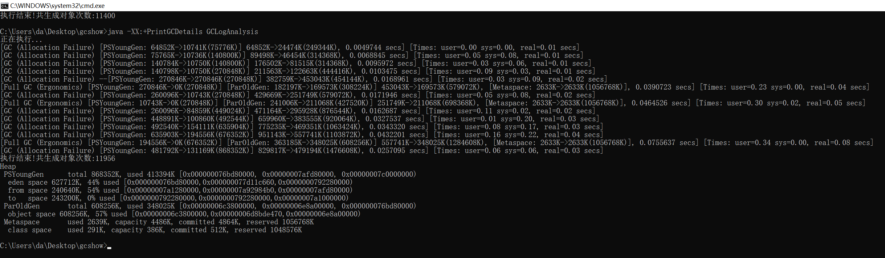

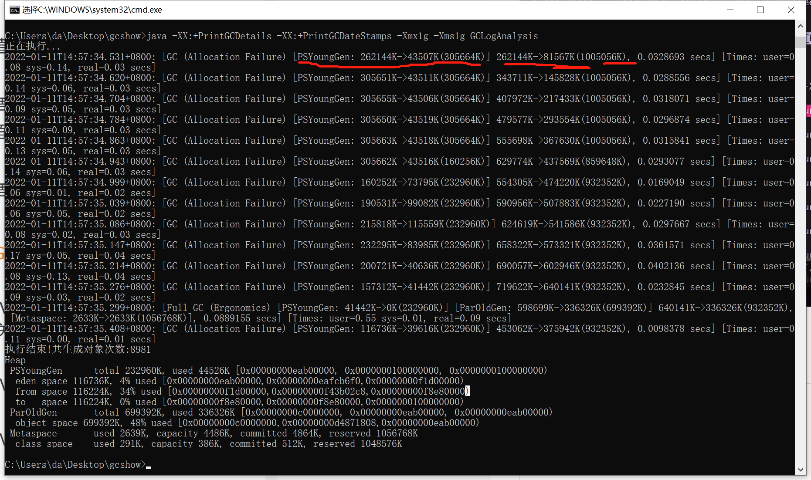

以上标红的部分是垃圾回收时，堆内存的变化情况，后面的【Times: ...】是CPU的使用情况。

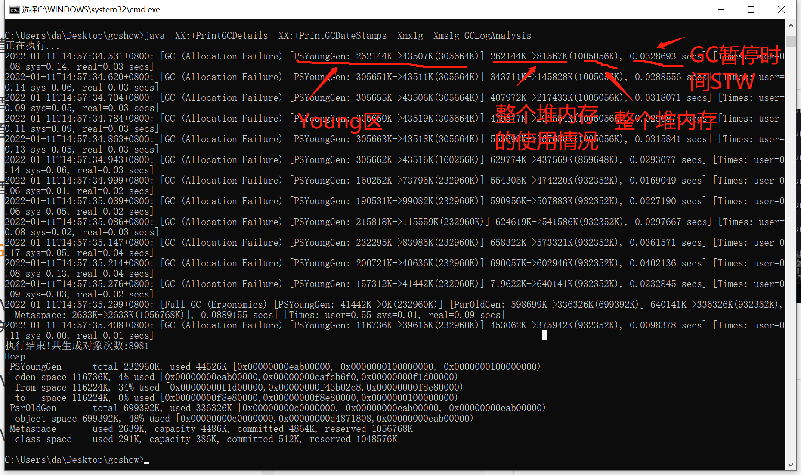

特别注意：第一次gc回收，还没有对象能够晋升到old区，young区和整个堆内存的回收前使用量是一样的。

第一次young区gc回收有多少对象晋升到old区：262-43 = 219，262-81 = 181，219-181 = 38；

以上例子，有大概38m进入old区。

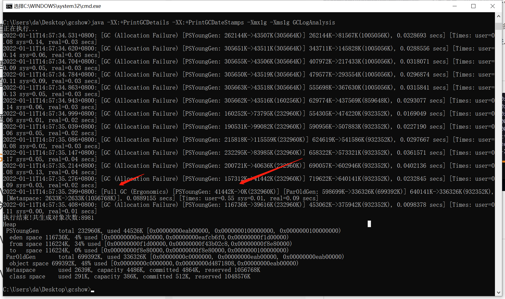

full gc直接将young区清空。

java -XX:+PrintGCDetails -XX:+PrintGCDateStamps -Xmx1g -Xms1g GCLogAnalysis

注意点：

1.不配置初始化堆内存-Xms1g，会不断动态申请堆内存，而且会造成gc次数增加。

2.-Xmx1g -Xms1g，改变堆内存的大小，会影响gc的次数；并不是堆内存越大越好，gc次数虽然少了，但是gc暂停的时间增大了。

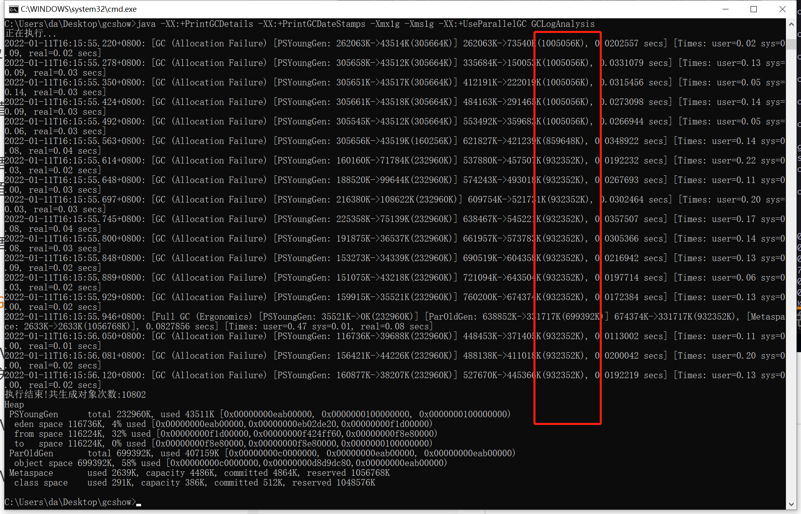

整堆内存大小在变化，原因是，Java8默认使用自适应参数，比如年轻代晋升到老年代的阈值15，不一定会被严格遵守。

Java8默认使用的是并行GC（-XX:UseParallelGC ），以上的案例是并行GC。

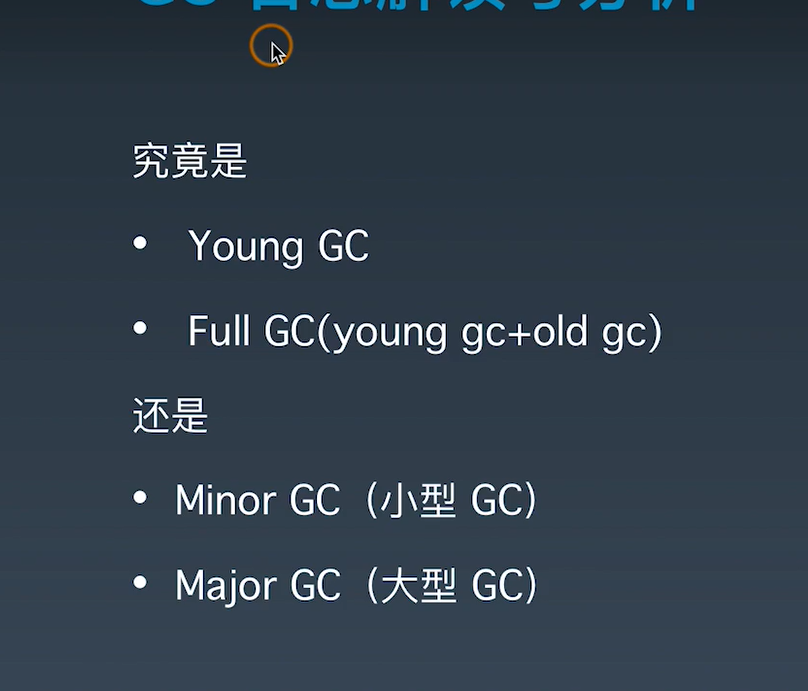

以上两种说法都可以。

2.串行化GC

java -XX:+PrintGCDetails -XX:+PrintGCDateStamps -Xmx1g -Xms1g -XX:UseSerialGC GCLogAnalysis

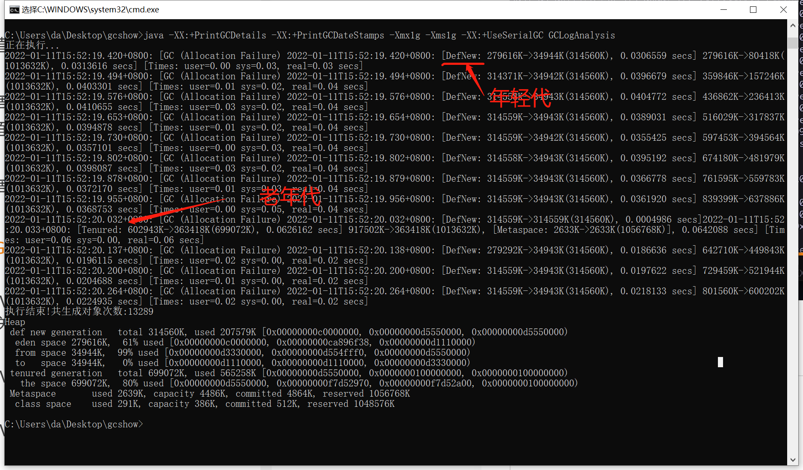

回收效率较低。

3.cms回收器

java -XX:+PrintGCDetails -XX:+PrintGCDateStamps -Xmx1g -Xms1g -XX:UseConcMarkSweepGC GCLogAnalysis

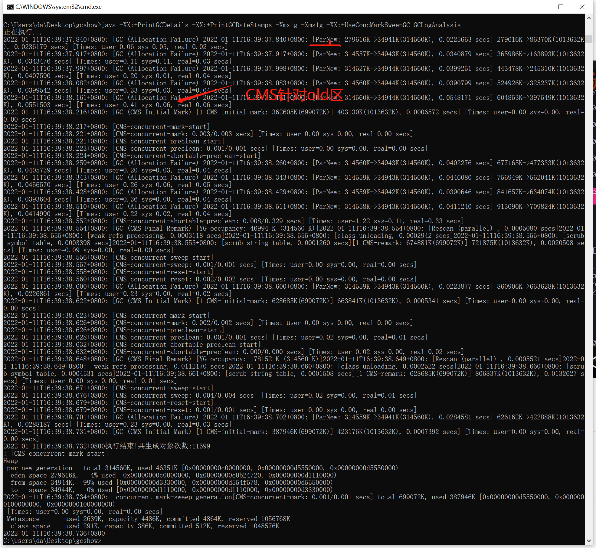

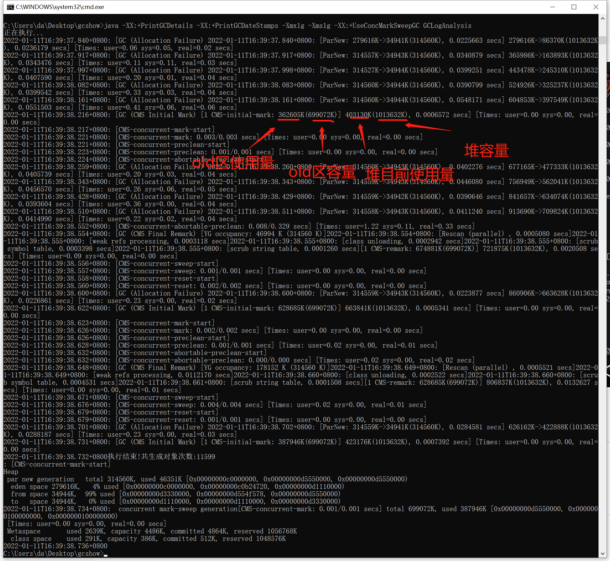

注意点：因为cms针对的是old区，所以期间可能会发生一次或多次的young区gc。

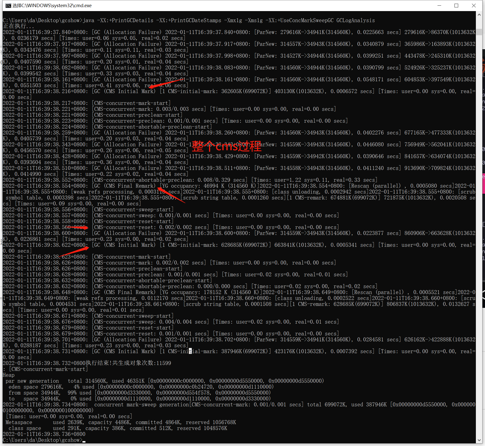

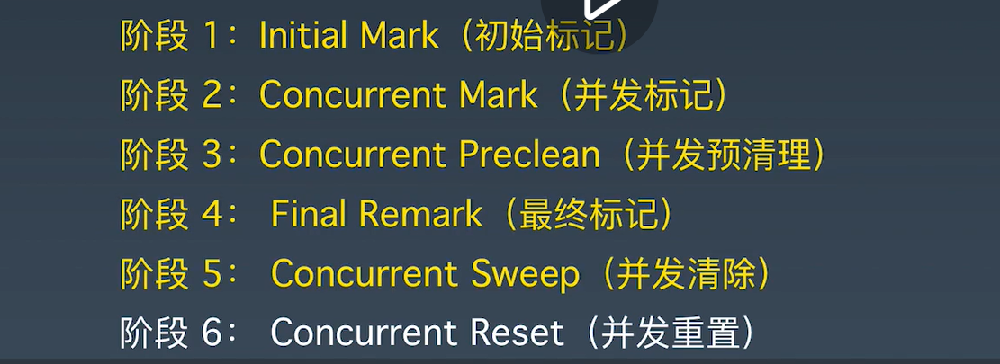

注意，加大堆内存，可能会实现只有younggc没有cmsGC。

4.G1GC

java -XX:+PrintGCDetails -XX:+PrintGCDateStamps -Xmx1g -Xms1g -XX:UseG1GC GCLogAnalysis

java -XX:+PrintGC -XX:+PrintGCDateStamps -Xmx1g -Xms1g -XX:UseG1GC GCLogAnalysis

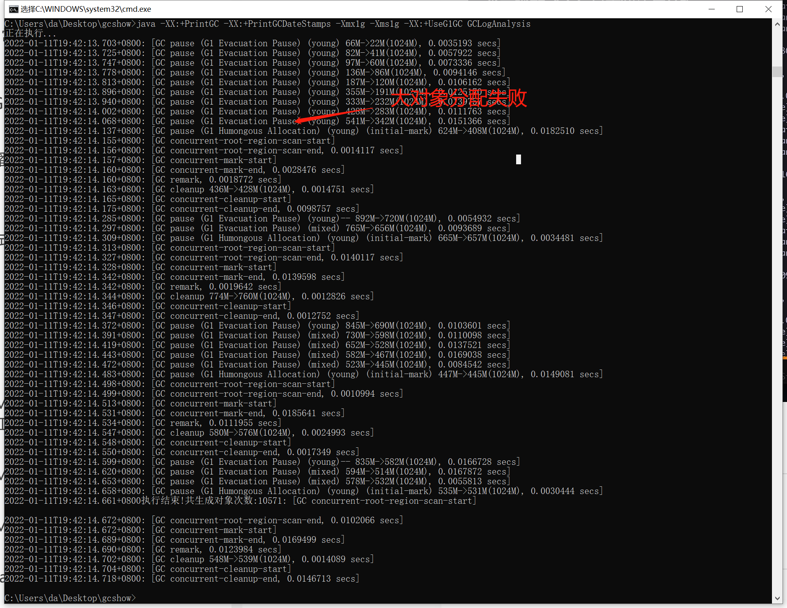

当增大内存时，可能出现只对young区进行垃圾回收的情况。

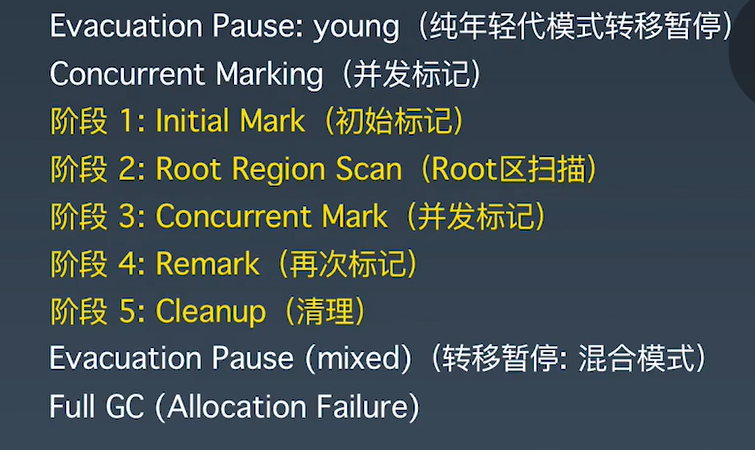

5.sb压测gateway-server-0.0.1-SNAPSHOT.jar

启动

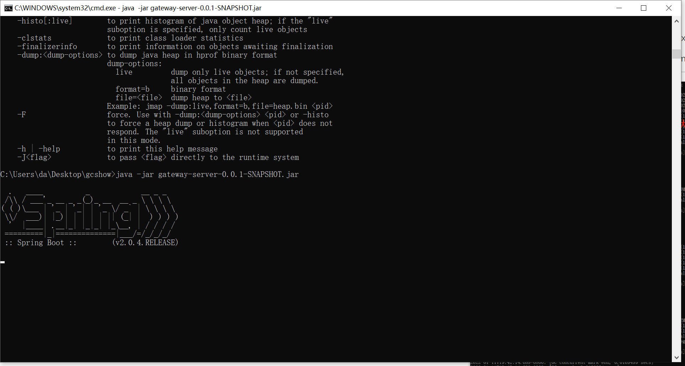

压测

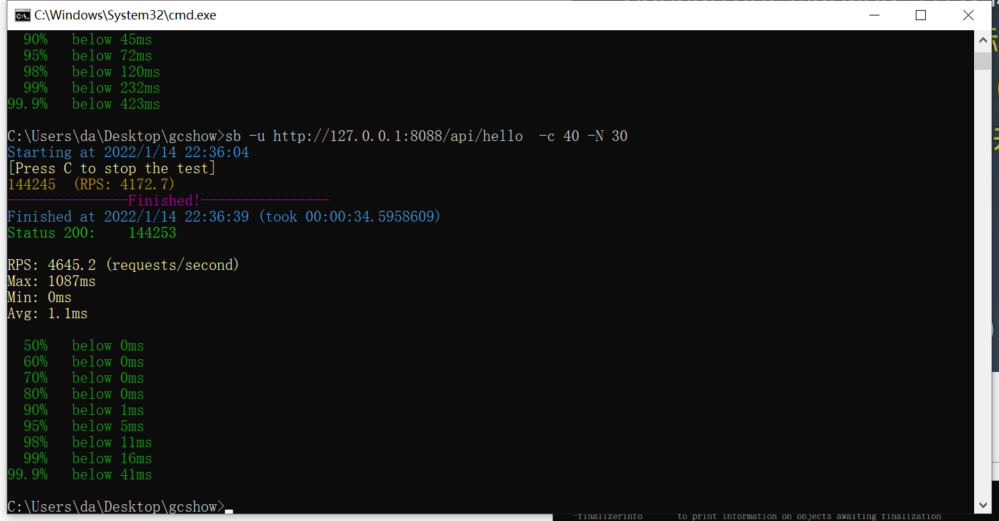