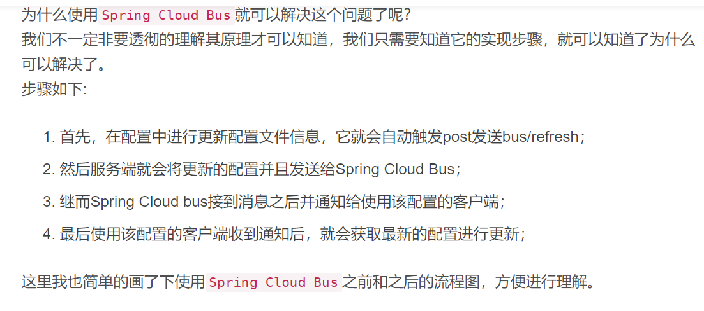

# 学习杂记

```
@EnableTransactionManagement(proxyTargetClass = true)//cglib代理
```

spring.profiles.active：dev

1、dev、pro、test分别为：开发、生产、测试环境配置
2、我们除application.properties外，还可以根据命名约定（
命名格式：application-{profile}.properties）来配置，如果active赋予的参数没有与使用该命名约定格式文件相匹配的话，app则会默认从名为application-default.properties 的配置文件加载配置。
如：spring.profiles.active=hello-world,sender,dev 有三个参数，其中 dev 正好匹配下面配置中的application-dev.properties 配置文件，所以app启动时，项目会先从application-dev.properties加载配置，再从application.properties配置文件加载配置；


@TableField(exist = false) 注解加载bean属性上，表示当前属性不是数据库的字段，但在项目中必须使用，这样在新增等使用bean的时候，mybatis-plus就会忽略这个，不会报错.

@EnableAspectJAutoProxy(proxyTargetClass = true) 设置基于CGLIB 技术实现

lists.newarraylist()：

List<String> list = new ArrayList<String>(); 

new arraylist() ：

List<String> list = Lists.newArrayList();

Lists和Maps是两个工具类, Lists.newArrayList()其实和new ArrayList()几乎一模一样, 唯一它帮你做的(其实是javac帮你做的), 就是自动推导(不是"倒")尖括号里的数据类型. 

目录MapStruct是用来做什么的？使用MapStruct解决上述问题添加默认方法可以使用abstract class来代替接口可以使用多个参数直接使用参数作为属性值更新对象属性没有getter/setter也能赋值使用Spring依赖注入自定义类型转换首先来了解一下DTO，DTO简单的理解就是做数据传输对象的，类似于VO，但是VO用于传输到前端。（~~）从上面代码可以看出，通过getter、setter的方式把一个对象属性值复制到另一个对象中去还是很麻烦的，尤其是当属性过多的时候。而MapStruct就是用于解决这种问题的。

mybatis如果不做区分大小写的设置的话，默认是不会区分大小写的，执行出的sql字段全部大写。

所以如果要返回的字段按驼峰式字段命名，则可通过以下两种方式返回结果集：

1、返回字段映射到实体类型：

   以“com.demo.pojo.User”为例：

  设置select语句的返回类型为：resultType="com.demo.pojo.User"

2、返回字段映射到map类型：

   <resultMap id="mapDemo" type="java.util.map">

         <result column="userName" property="userName" />
    
         <result column="userAge" property="userAge" />

  </resultMap>

  在select语句中设置返回map类型：resultMap="mapDemo"

 

注意以上两种写法的区别，如果返回的是实体类，属性是resultType，如果返回的是map，属性是resultMap.

特别要注意的是返回map类型时，select语句中的字段名称要和map中的对应上，否则该字段仍然会返回全大写形式。如：map中定义的字段名称是name，而select中是cname，那么字段对应不上，最终会返回为CNAME。
3.Mybatis 全局属性 mapUnderscoreToCamelCase
在通常情况下，java中的实体类中的属性一般是采用驼峰命名命名的，而数据库中表的字段则用下划线区分字母。在这种情况下，Mybatis提供了一个全局属性mapUnderscoreToCamelCase来解决两者名字不一致的问题。

<settings>  
    <!--其他配置...  -->  
    <setting name="mapUnderscoreToCamelCase" value="true"/>  
    <!--其他配置...  -->  
</settings>  

注意：因为该属性是全局属性，所以需要配置在Mybatis的配置文件中，而不是Mapper.xml映射文件中。


Spring Boot中的SPI机制

在Spring中也有一种类似与Java SPI的加载机制。它在META-INF/spring.factories文件中配置接口的实现类名称，然后在程序中读取这些配置文件并实例化。
 这种自定义的SPI机制是Spring Boot Starter实现的基础。

@Order(Ordered.HIGHEST_PRECEDENCE)代表这个过滤器在众多过滤器中级别最高，也就是过滤的时候最先执行

而@Order(Ordered.LOWEST_PRECEDENCE)恰恰相反，表示级别最低，最后执行过滤操作。

application.yml 和bootStrap.yml 在同一目录下，则bootStrap.yml 的加载顺序要高于application.yml,即bootStrap.yml 会优先被加载。

  原理：bootstrap.yml 用于应用程序上下文的引导阶段。

​       bootstrap.yml 由父Spring ApplicationContext加载。

​      **•bootstrap.yml 可以理解成系统级别的一些参数配置，这些参数一般是不会变动的。**
​      •application.yml 可以用来定义应用级别的，如果搭配 spring-cloud-config 使用 application.yml 里面定义的文件可以实现动态替换。

在bootstrap文件里面可以配置这些东西, 包括tomcat的端口和应用的名称spring.name等

ootstrap.yml文件的配置如下:


发送消息到rabbitmq

Url: http://127.0.0.1:10011/actuator/bus-refresh

Method: post

查看rabbitmq:

、

postman


后来经过多方资料查看才明白原来bootstrap.yml只在SpringCloud下生效,要想在SpringBoot框架下生效的话可以引入springCloud的相关依赖。

```
<dependency>
    <groupId>org.springframework.cloud</groupId>
    <artifactId>spring-cloud-context</artifactId>
    <version>2.0.1.RELEASE</version>
</dependency>
```

